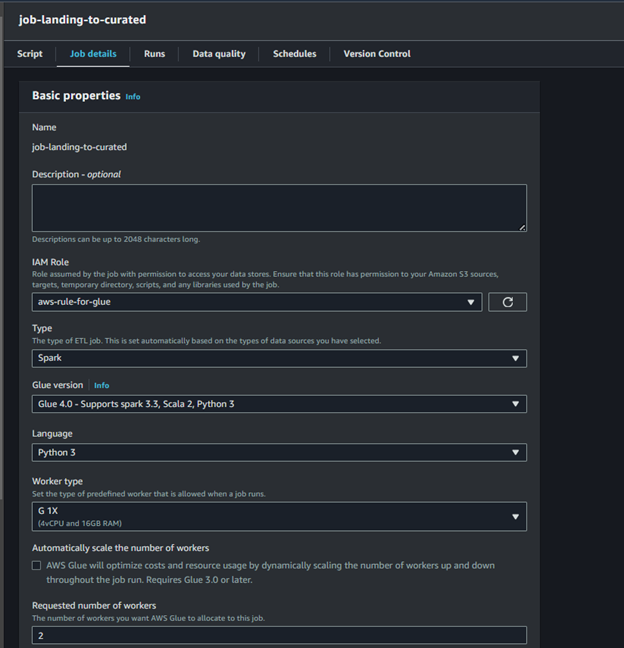
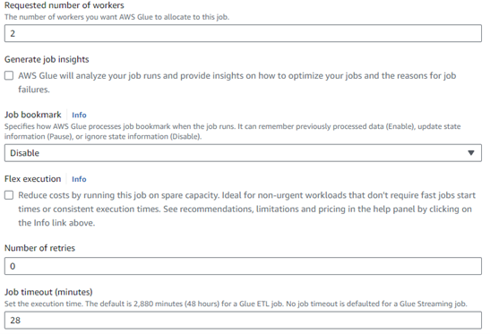
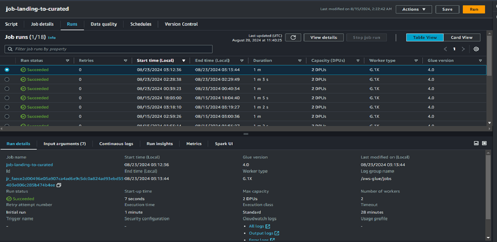
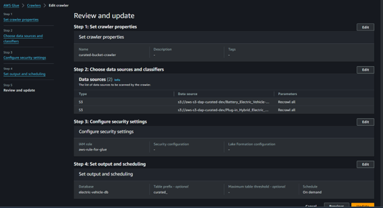

# ev-data-etl-pipeline-aws
AWS-based ETL pipeline for electric vehicle data processing. It ingests, transforms, and loads data into a data warehouse using services like AWS Lambda, Glue, Athena and S3. The pipeline ensures data cleaning, validation, and enrichment for comprehensive analysis and reporting.

## AWS Lambda
 AWS Lambda function is designed to fetch CSV data from a URL provided by the US Gov API, process it, and store it in an Amazon S3 bucket.

Dataset Used:
Washington State Open Data Portal

- https://data.wa.gov/api/views/f6w7-q2d2/rows.csv?accessType=DOWNLOAD

### Configurations 
The timeout for the AWS Lambda function was set to 1 min 59 seconds to ensure that the function has sufficient time to complete its tasks, especially given that it involves multiple steps such as making HTTP requests to fetch data from the US gov API, processing the data, and uploading it to an S3 bucket.

## S3 
### Raw Zone: Landing Bucket (aws-s3-landing-dev) 
Setup: Configure AWS S3 to store raw data ingested by Lambda. Split the datasets into three different folders 
#### Reason: 
Provides a scalable and durable storage solution for raw data.   

 ### Transformed Zone: Transformed Bucket (aws-s3-curated-dev) 
 Use to store the CSV file from the (job_landing_to_curated) Glue Job
#### Reason: 
Provides a scalable and durable storage solution for curated data based on different data sets.

 ## AWS Glue
### Glue Job (job_landing_to_curated)
Setup: This AWS Glue task takes a single file from landing bucket, splits data into two files based on categories and does some column naming convention updates before saving in different folders for each type of data set in curated bucket.  

#### Reason: 
Converting these files to a better CSV simplifies data manipulation and analysis, making it more accessible for downstream processes such as data analytics, reporting, and machine learning.

### Configuration
Number of workers: 2 for cost control
Job Timout: 20 minutes - for cost control in cost of exceptions while job keeps running and consuming resources

## Glue Crawler 
AWS Glue Crawler is a service that automatically discovers and catalogs data in various data stores, such as S3, RDS, and DynamoDB. It simplifies the process of managing and maintaining up-to-date metadata for your datasets.

### (landing-bucket-crawler)
Setup: Configure Glue Crawler to automatically discover data stored in S3 and populate the Glue Data Catalog.

### (curated-bucket-crawler)
Setup: Configure Glue Crawler to automatically discover data stored in S3 and populate the Glue Data Catalog.

### Reason: 
Simplifies metadata management by automatically detecting schema changes and updating the data catalog.
 To automate the process of detecting schema changes and updating the Glue Data Catalog, ensuring data remains easily accessible and queryable.
Setup:Create and configure a Glue Crawler in the AWS Glue Console, specify data sources, define an IAM role with appropriate permissions, and run the crawler to populate the Glue Catalog Database with metadata

## Glue Catalog Database
AWS Glue Catalog Database is a centralized repository to store metadata about data assets. It helps in managing schema and data locations, making it easier for ETL jobs to discover and query data efficiently.

### Reason: 
To organize and maintain metadata of datasets, enabling easy data discovery and management.
### Setup: 
Create a Glue Catalog Database using the AWS Glue Console or AWS CLI, defining necessary metadata and schema details.

## Glue Catalog Tables
Glue Catalog Tables are metadata definitions in the Glue Catalog Database that describe the structure and location of data stored in various data stores.

### Reason:
To enable data analysts and engineers to query and transform data efficiently without worrying about data location or schema.

### Setup:
Create Glue Catalog Tables via the AWS Glue Console, AWS CLI, or by running AWS Glue crawlers to automatically infer the schema and create tables.
