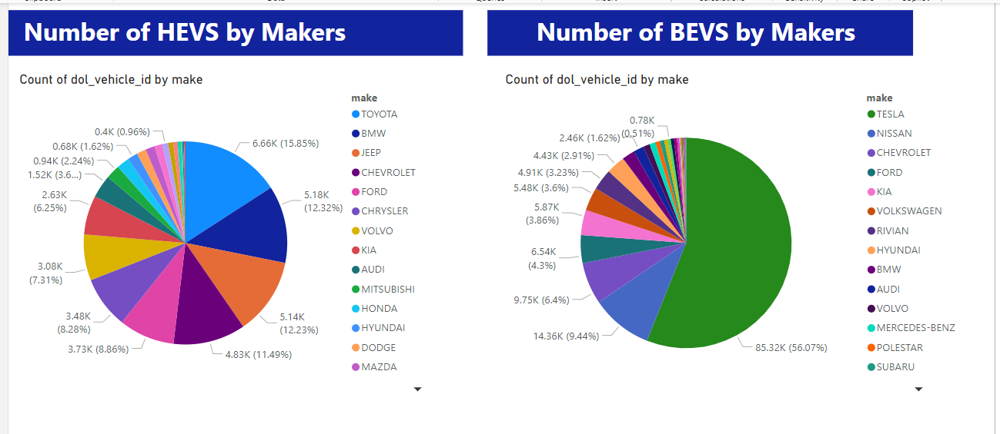
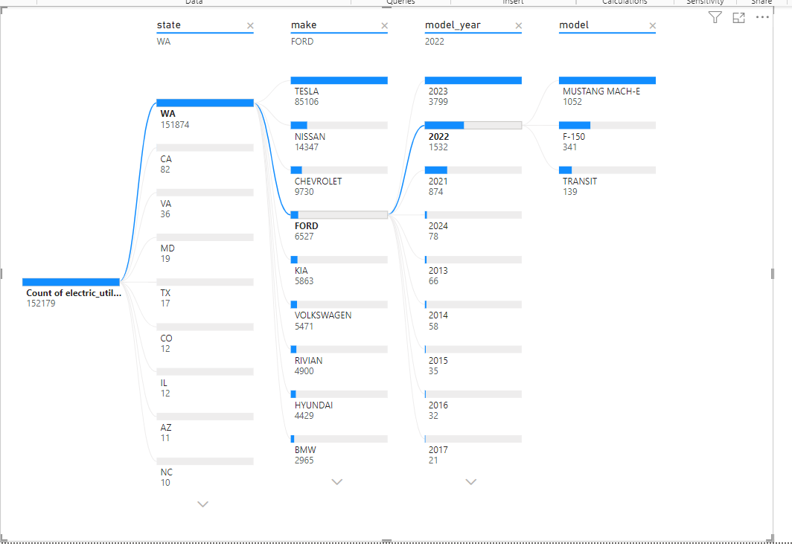
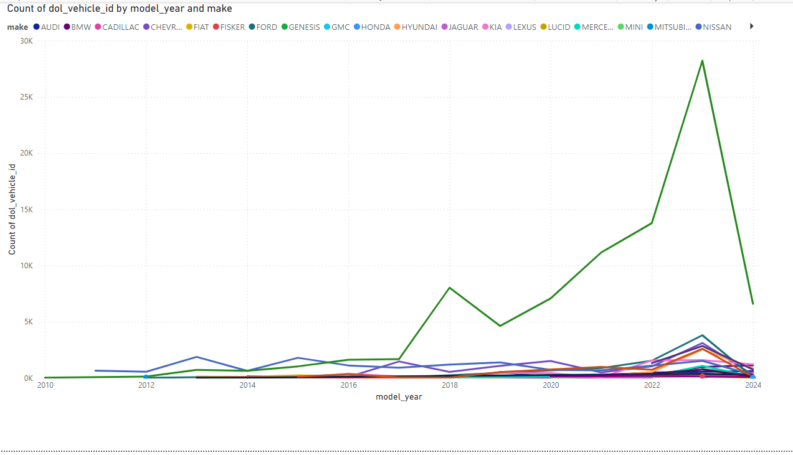
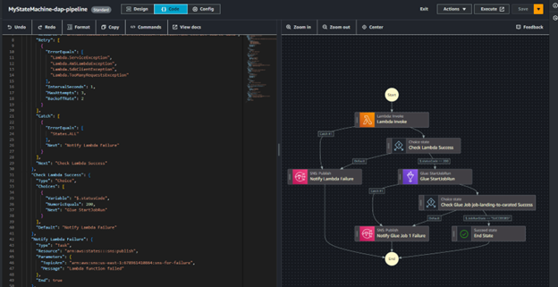
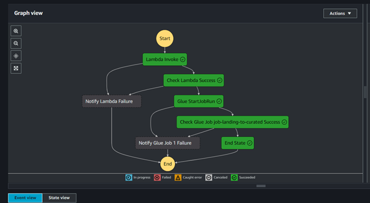

# EV Data ETL Pipeline - AWS

This repository contains the ETL pipeline for processing Electric Vehicle (EV) data using a variety of AWS services, including Lambda, S3, Step Functions, Glue, Athena, and Data Catalog. The pipeline automates the ingestion, transformation, and storage of EV-related data for downstream analytics, reporting, and visualizations.

## Features

- **Serverless Architecture:** Uses AWS Lambda for compute tasks, providing a scalable, cost-effective serverless solution.
- **Data Ingestion:** Data is automatically ingested from S3 buckets and triggered by events such as file uploads.
- **Data Transformation:** AWS Glue handles data transformations, utilizing Spark-based jobs to convert raw data into structured formats.
- **Data Querying:** Amazon Athena is used to query processed data directly from S3 using SQL queries.
- **Metadata Management:** AWS Glue Data Catalog tracks metadata, schema, and table definitions for easy querying.
- **Orchestration:** AWS Step Functions orchestrate the entire ETL workflow, managing the coordination of services.
- **Monitoring:** AWS CloudWatch monitors all pipeline processes, logging, and providing alerts for failures and performance metrics.
- **Data Visualization:** Power BI is used to create dashboards and reports, visualizing key metrics such as sales by vehicle type, model, and region across the US over time.

## AWS Services Used

1. **Lambda:** To handle specific data processing tasks and orchestrations.
2. **S3:** For storing raw data, intermediate files, and processed output.
3. **Glue:** For ETL processes, transforming raw data into queryable formats like Parquet or CSV.
4. **Step Functions:** To orchestrate and monitor the ETL workflow.
5. **Athena:** For querying processed data directly from S3.
6. **Glue Data Catalog:** To manage schema and metadata for the datasets.
7. **CloudWatch:** For logging, monitoring, and alerting across the pipeline.
8. **Power BI:** For creating visualizations and dashboards on top of the curated data to show EV sales trends, vehicle models, and regions.

## Prerequisites

Before deploying this pipeline, ensure the following:

- **AWS Account:** You will need an active AWS account with permissions to create Lambda functions, S3 buckets, Glue jobs, Step Functions, and more.
- **AWS CLI:** Set up AWS CLI or use the AWS Management Console to manage and deploy services.
- **Data Source:** Data should be available in S3 for ingestion into the pipeline.

## Architecture

The high-level architecture of the pipeline is as follows:

1. **Data Ingestion:**
   - Raw data is uploaded to an S3 bucket.
   - An S3 event triggers an AWS Lambda function that kicks off the pipeline.

2. **Data Transformation:**
   - AWS Step Functions orchestrate the workflow by calling Glue jobs to transform the data.
   - Glue uses Spark to clean and convert the data into the required format (e.g., Parquet or CSV).

3. **Data Storage and Querying:**
   - The processed data is stored in another S3 bucket.
   - AWS Glue Data Catalog stores metadata and schema information for Athena to query the data.

4. **Data Analytics and Visualization:**
   - Amazon Athena is used to run queries on the processed data directly from S3 using SQL, enabling quick and scalable data analysis.
   - Power BI is used to create visual reports, showcasing sales by vehicle type, model, and region over time.

## Getting Started

### 1. Clone the Repository

```bash
git clone https://github.com/embeyi/ev-data-etl-pipeline-aws.git

```


## Power BI Visuals and Their Role in Business Decision-Making

Power BI is a powerful business intelligence tool used to visualize data and derive actionable insights. In this project, curated EV data is visualized using Power BI to track sales trends for specific vehicle models across different regions of the US over the years. These visuals help businesses:

- **Identify Market Trends:** Power BI's visuals provide a clear view of sales patterns and trends across regions, helping businesses understand where demand is growing and where it’s declining.
  

- **Faster Response to Market Changes:** Visual analytics in Power BI enables faster responses to market changes by uncovering real-time insights. Whether it’s identifying low-performing models or emerging high-demand regions, businesses can adapt quickly to maintain competitiveness.

By integrating this pipeline with Power BI, businesses not only automate the ingestion and processing of raw data but also unlock the ability to visualize this data in meaningful ways, driving better and faster business decisions.




- **Enhanced Reporting:** With Power BI, users can create interactive reports that allow stakeholders to drill down into specific data points, filter insights by region or time period, and adjust focus based on evolving business needs.



- **Make Data-Driven Decisions:** Instead of relying on intuition, Power BI dashboards empower decision-makers with data-driven insights. Visualizations highlight key performance indicators (KPIs), making it easier to set strategic goals and allocate resources effectively.




## AWS Lambda

The AWS Lambda function is responsible for fetching CSV data from the US Gov API, processing it, and storing the result in an S3 bucket.

**Dataset Source:**
- **Washington State Open Data Portal:**  
  [CSV Download Link](https://data.wa.gov/api/views/f6w7-q2d2/rows.csv?accessType=DOWNLOAD)

### Configurations
- **Timeout:** The Lambda function's timeout is set to 1 minute and 59 seconds. This ensures enough time to complete all tasks, including making HTTP requests to fetch the data, processing it, and uploading the processed file to S3.

---

## S3

### Raw Zone: Landing Bucket (`aws-s3-landing-dev`)
- **Setup:** AWS S3 is configured to store raw data ingested by the Lambda function. The raw data is organized into three different folders for better structure and accessibility.
  
- **Reason:** S3 provides a scalable and durable storage solution for raw data, ensuring data reliability and availability.

### Transformed Zone: Transformed Bucket (`aws-s3-curated-dev`)
- **Setup:** This bucket stores the transformed CSV files generated by the Glue job (`job_landing_to_curated`).

- **Reason:** Storing curated data in a separate bucket ensures a clean separation of raw and processed datasets, making the pipeline more modular and organized for downstream use.

---

## AWS Glue

### Glue Job (`job_landing_to_curated`)
- **Setup:** This Glue job takes a single file from the landing bucket, splits the data into two files based on categories, and updates column names. The processed files are stored in separate folders within the curated bucket.


- **Reason:** This transformation standardizes the data structure, simplifies future manipulations, and makes it more accessible for analytics, reporting, and machine learning.

### Configurations
- **Workers:** 2 workers for cost-effective resource management.
- **Job Timeout:** 20 minutes, ensuring cost control in case of job exceptions to avoid unnecessary resource consumption.

---

## AWS Glue Crawler

The AWS Glue Crawler automatically discovers and catalogs data across various sources like S3, RDS, and DynamoDB, managing up-to-date metadata for your datasets.


### Crawler for Landing Bucket (`landing-bucket-crawler`)
- **Setup:** Configured to automatically discover data in the S3 landing bucket and update the Glue Data Catalog.

### Crawler for Curated Bucket (`curated-bucket-crawler`)
- **Setup:** Configured to automatically discover data in the S3 curated bucket and update the Glue Data Catalog.

- **Reason:** Simplifies metadata management by automatically detecting schema changes and updating the catalog. This ensures data is easily accessible and queryable.

---

## Glue Catalog Database

The Glue Catalog Database serves as a centralized metadata repository for data assets, helping manage schema and locations for efficient ETL jobs.

- **Reason:** The database organizes and maintains metadata, making it easier to discover and manage datasets.
  
- **Setup:** Create the Glue Catalog Database using the AWS Glue Console or CLI, ensuring it contains necessary metadata and schema definitions for your datasets.

---

## Glue Catalog Tables

Glue Catalog Tables store metadata definitions in the Glue Catalog Database, describing the structure and location of data in various stores.

- **Reason:** These tables allow analysts and engineers to efficiently query and transform data without worrying about schema details or data locations.
  
- **Setup:** You can create these tables via the AWS Glue Console, AWS CLI, or by running Glue Crawlers that automatically infer schema and update the table definitions.


## Orchestration:
- AWS Step Functions orchestrate the entire ETL workflow, managing the coordination of services.

  



